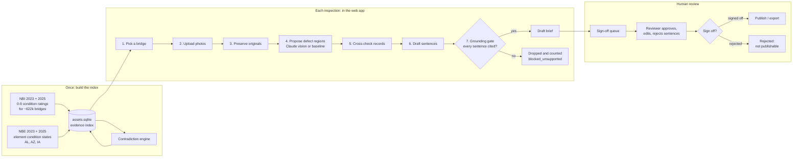
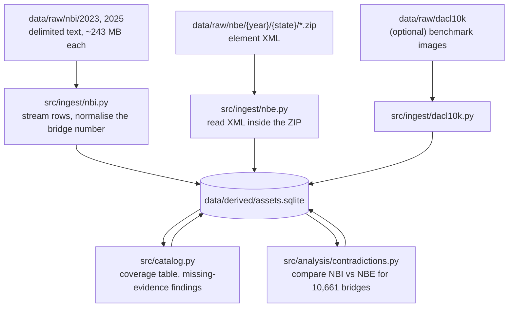
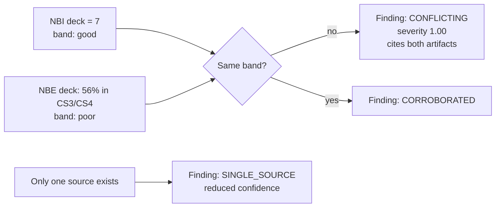
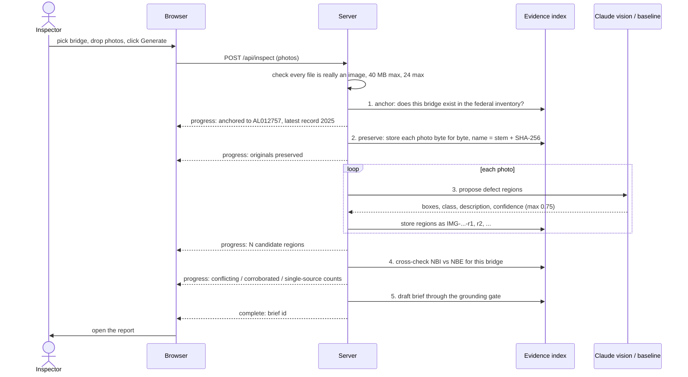
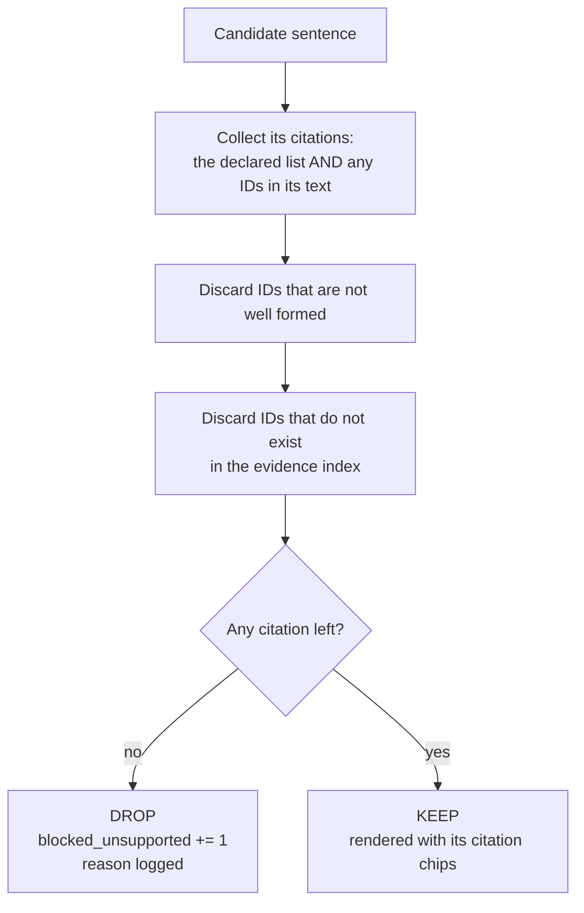
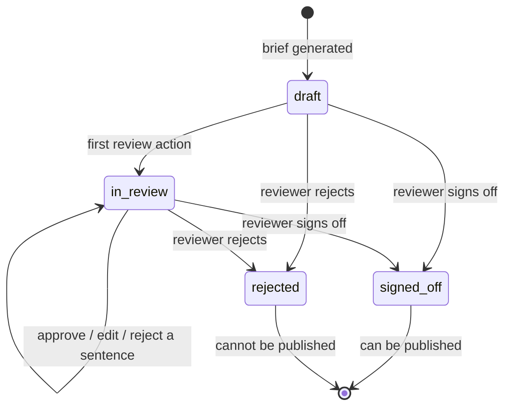
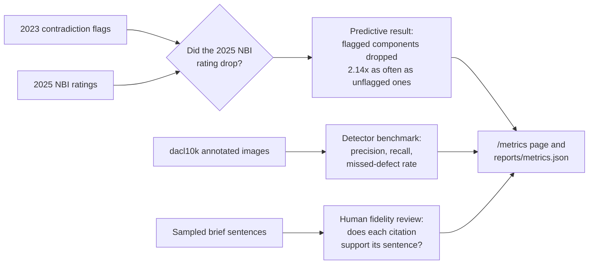

# Process: how Bridge Brief works, end to end

This document follows the data through the project, from public downloads to a
signed-off inspection brief. The diagrams render on GitHub; each one is followed by
the same flow in words.

---

## The whole picture



**In words:**

1. **Once**, the public federal records are loaded into one SQLite file, the
   *evidence index*. The contradiction engine then compares the two kinds of record
   for every bridge that has both.
2. **For each inspection**, an inspector picks a bridge, uploads photos, and the app
   stores the originals, proposes defect regions on them, cross-checks the records,
   and drafts a brief. Every sentence must cite a real record or it is dropped.
3. **A human** reviews the draft sentence by sentence and signs it off or rejects it.
   Only a signed-off brief can be published.

---

## Stage 0: Building the evidence index (once)



| Step | Command | What happens |
|---|---|---|
| Ingest NBI | `python -m src.ingest.nbi --year 2023 --year 2025` | 621,581 + 624,193 rows read, 0 rejected. Each rating becomes an artifact such as `NBI-AL012757-2023-deck`. |
| Ingest NBE | `python -m src.ingest.nbe --year 2023 --year 2025` | 66,597 + 55,905 element records, 0 rejected. Each becomes an artifact such as `NBE-AL012757-2023-12-cs3`. |
| Catalog | `python -m src.catalog --record-missing` | Counts what exists. Records a *missing evidence* finding for every Alabama, Arizona or Iowa bridge that has no element data (other states publish none, so their absence is not flagged). |
| Contradictions | `python -m src.analysis.contradictions --year 2023` | Finds bridges where the two official records disagree. |

`run.bat build` runs all of these in order.

**Rules at this stage**

- `data/raw/` is **never written to**. Every output goes to `data/derived/`.
- **The bridge number is state-qualified**: `AL012757`, not `012757`. The bare number
  repeats across states (40,374 numbers are shared by more than one state).
- **Every ID is deterministic**, built from where the data came from. Rebuilding the
  index gives every record the same ID again, so old briefs still resolve.
- **Resumable.** An interrupted ingest is re-run; finished files are skipped.

---

## Stage 1: The contradiction engine (the core idea)

Two federal records describe the same bridge in different ways:

| Record | What it says | Scale |
|---|---|---|
| **NBI** | One overall rating per component (deck, superstructure, substructure) | 0 to 9, where 7 is "good" and 4 is "poor" |
| **NBE** | How much of each part is in each condition state | CS1 good, CS2 fair, CS3 poor, CS4 severe |

The engine turns both into the same three bands (good, fair, poor) and compares them.



**Real example, structure AL012757 in 2023:** the NBI rates the deck **7 (good)**
[`NBI-AL012757-2023-deck`]. The element data puts **4,078 of 7,255 units, 56%, in
poor or severe condition** [`NBE-AL012757-2023-12-cs3`]. That is a contradiction. The
2025 NBI release later rated the same deck **6**.

Every finding gets exactly one **evidence tier**:

| Tier | Meaning | Shown how |
|---|---|---|
| `conflicting` | Sources disagree | Most prominently, first in the brief |
| `corroborated` | Two or more independent sources agree | Normal |
| `single_source` | Only one source observes it | Marked as reduced confidence |

---

## Stage 2: One inspection in the web app

This is what happens between clicking **Generate brief** and seeing the report. The
code is `src/ui/workflow.py`; each stage streams a progress line to the browser as it
finishes.



| Stage | What it does | What it refuses to do |
|---|---|---|
| **Validate** | Checks the file contents, not the extension, are JPEG, PNG, WebP, TIFF or BMP | Accept anything before every file passes |
| **1. Anchor** | Finds the bridge in the federal inventory | Attach a photo to a bridge that is not on record |
| **2. Preserve** | Stores each photo unmodified under `data/uploads/{bridge}/`, named with its SHA-256 | Overwrite an existing photo, or alter one |
| **3. Detect** | Claude vision (with an API key) or the classical baseline proposes regions | Judge safety, recommend repairs, or report more than 0.75 confidence |
| **4. Cross-check** | Runs the contradiction engine for this bridge's latest year | Invent a finding where a source is missing |
| **5. Draft** | Writes the brief sections: summary, contradictions, condition, imagery, evidence gaps | Keep any sentence without a valid citation |

If Claude vision fails on one photo, the baseline runs on that photo instead and the
page says so. It never silently produces nothing.

---

## Stage 3: The grounding gate

Every sentence the drafter writes is checked by plain, deterministic code
(`src/generate/grounding.py`). No AI model is trusted to cite correctly.



A made-up ID cannot rescue a sentence: an ID that looks right but does not exist in
the index does not count. The gate checks that each sentence is *attributable*, which
is what lets a human verify it; judging whether it is *true* is the reviewer's job.

The `blocked_unsupported` counter is shown on every report. It is a feature: it
proves that anything unsupported was caught rather than published.

Every brief also names the evidence it does **not** have, for example "no sensor
readings and no field notes were supplied". Missing evidence is reported, never
assumed.

---

## Stage 4: Human review, sign-off and publication



| Step | Where | Rule |
|---|---|---|
| **Queue** | `/queue` | Briefs waiting for a human, most urgent first: in review before draft, then by highest contradiction severity, then by most blocked sentences |
| **Review** | Report page | Approve, edit or reject each sentence. Every action is stored with the reviewer's name, in an append-only table. |
| **Sign-off** | Report page | A named person signs off or rejects. A name is required. After that, **sentence edits are refused**. A later sign-off decision is still accepted and appended to the trail; the publish gate always reads the latest one. |
| **Publish** | Report page, or `python -m src.generate.export` | Refused unless the latest entry in the sign-off trail is `signed_off` **for this exact version**. There is no override flag. |

Every exported brief carries a banner saying it is **not** a safety clearance, **not**
a maintenance order and **not** an authorisation to act.

**Nothing in the code can mark a bridge safe, cleared or scheduled.** A test checks
that no such column, route or function exists.

---

## Stage 5: Evaluation

All numbers are computed from real published data. No ground truth is invented.



| Measure | How | Current result |
|---|---|---|
| **Predictive validation** | Flag contradictions in 2023, check whether 2025 ratings dropped | When the NBI was more optimistic than the element data, the rating dropped **12.6% vs 5.9%** for unflagged bridges: **2.14x**, z = 9.47 |
| **Detector** | Baseline run against 7,910 dacl10k annotated images | Precision 0.0125, recall 0.0038. Poor, and published as poor. |
| **Unsupported content** | `blocked_unsupported` / sentences generated | Shown per brief and overall |
| **Source-link accuracy, contradiction precision** | Deterministic samples exported to `reviews/` for a human to label | Reported as `n/a` with the reason until labelled; never self-scored |
| **Correction effort** | Edits per finding during review | Counted from the review trail |

Run it all with `python -m src.eval.run_all`, or open **Evaluation** in the app.

---

## Where each part lives

```
src/
├── ingest/       Stage 0: read raw files          nbi.py, nbe.py, dacl10k.py, uploads.py
├── catalog.py    Stage 0: coverage + missing evidence
├── analysis/     Stage 1: contradiction engine    contradictions.py, findings.py, validate.py
├── detect/       Stage 2: defect proposers        vision.py (Claude), baseline.py
├── generate/     Stage 3: drafting + gate         brief.py, drafters.py, grounding.py, export.py
├── ui/           Stages 2 and 4: web app          server.py, workflow.py, webapp.py, review.py
├── eval/         Stage 5: metrics                 run_all.py, metrics.py, codebrim_benchmark.py
├── ids.py        The artifact ID system
├── store.py      Reading and writing the index
├── db.py         Connection, schema version, paths
└── schema.sql    The database schema
```

Layer rule, enforced by a test: **ingest never imports from generation**, and analysis
never imports from generation or the UI. Data flows one way.
